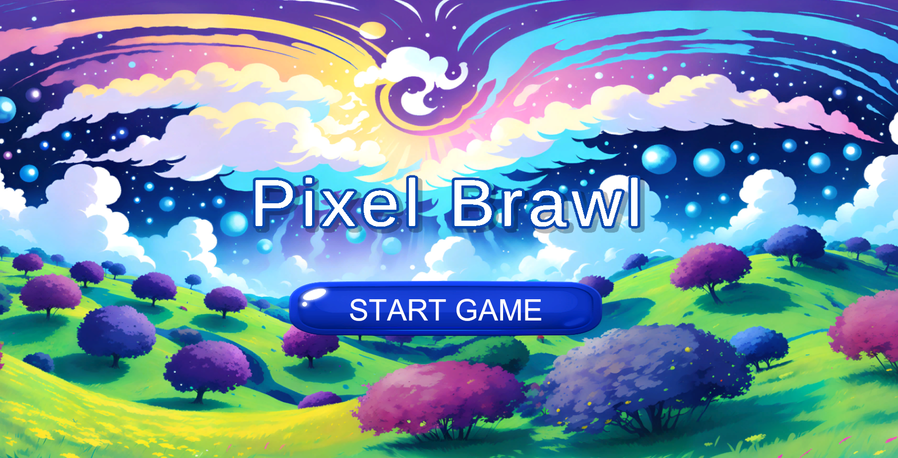
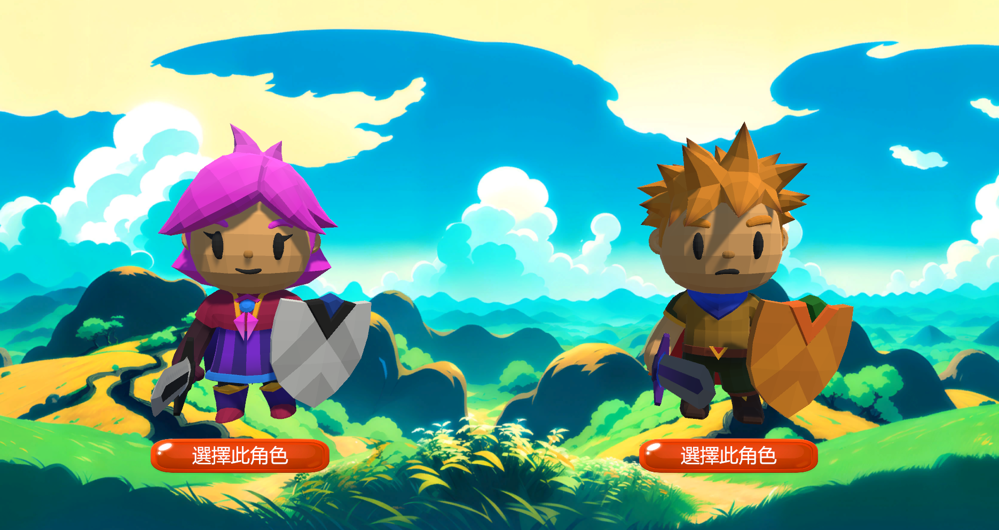
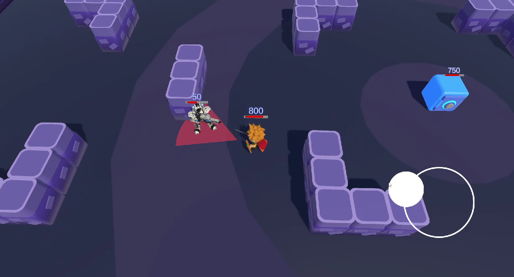
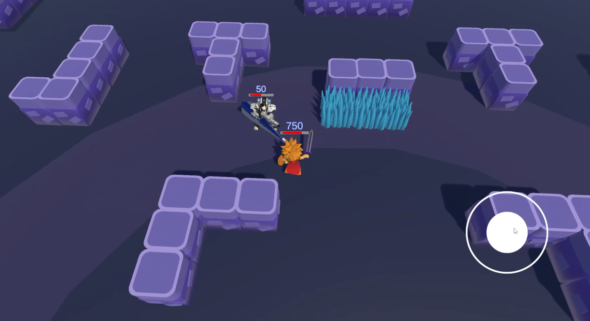
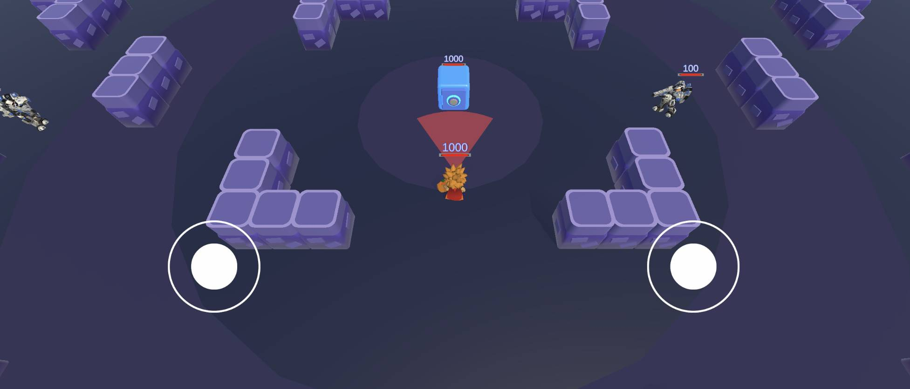
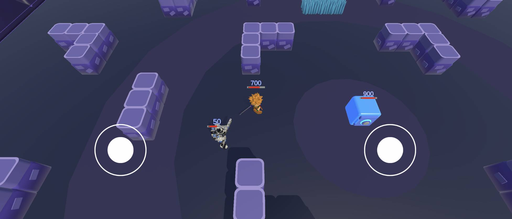
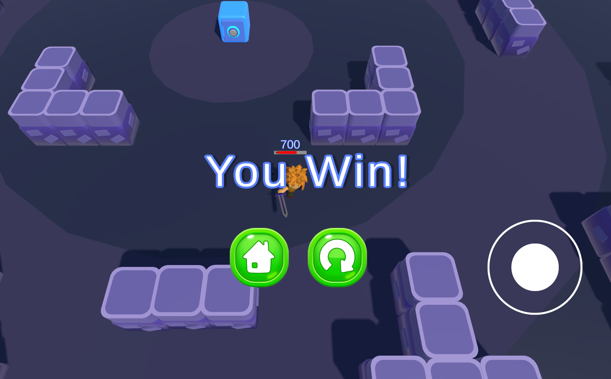
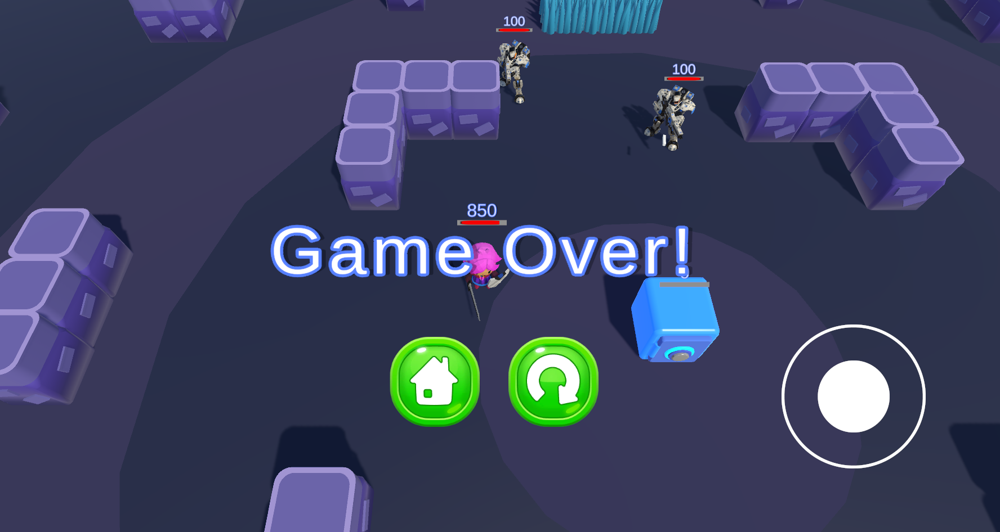

## 🕹️ 荒野亂鬥風格遊戲

## 這是一款使用 Unity 製作的簡易動作遊戲，玩家可操控角色利用搖桿攻擊敵人，具備方向攻擊、攻擊特效與音效,保衛金庫並擊敗全部的敵人。

## 🎮 遊戲玩法

- 使用虛擬搖桿控制角色移動與攻擊方向
- 按下攻擊搖桿觸發武器攻擊
- 攻擊時會播放斬擊特效與音效
- 玩家擊中敵人會造成傷害，金庫血量歸零即輸
- 避免敵人攻擊並消滅所有敵人獲得勝利

---

## 📱 支援平台

遊戲支援 **Android 手機版本**！  
玩家可透過 APK 檔安裝在 Android 裝置上進行遊玩，支援觸控虛擬搖桿操作，並針對手機橫向畫面進行遊玩。

👉 前往 [Releases](https://github.com/123Ryo/PixelBrawl/releases/tag/v0.3) 頁面，下載最新 APK 安裝檔案進行體驗 📦

---

## 📂 專案簡介

- `Assets/`：主要資源（腳本、場景、圖片等）
- `Scripts/`：玩家控制、攻擊判定、特效生成腳本
- `Scenes/`：包含主遊戲場景與封面場景
- `Prefabs/`：角色、攻擊特效預製件
- `README.md`：專案說明文件

---

## License

本專案所有原始碼與素材均為作者所有，未經明確書面授權，禁止任何形式的商業使用、重新發布、複製或改作。

非經作者授權，不得將本專案用於個人、商業、學習或教學等任何用途，亦不得以任何形式公開分享或散布本專案檔案。

詳細授權條款請參閱專案根目錄的 LICENSE 文件。

---

## 📦 技能

- C# 程式設計（移動控制、攻擊判定、特效生成）
- 音效與背景音樂整合
- UI 設計（生命條、勝負畫面顯示）
- 攻擊搖桿輸入偵測
- 動畫與特效同步

---

## 🔧 開發環境

- Unity 2021+
- Visual Studio 或 Rider

---

## 🖼️ 遊戲畫面預覽

🎮 遊戲封面

🗡️ 選角畫面

<h2>⚔️ 遊戲畫面</h2>

  <!-- 電腦版畫面區塊 -->
  

    <h3>💻 電腦版畫面</h3>
    
    
  

  <!-- 手機版畫面區塊 -->
  

    <h3>📱 手機版畫面</h3>
    
    
  

🏆 通關畫面

🏁 失敗畫面

---

## 🎬 遊戲影片展示

👉 [遊戲展示影片](Video/PixelBrawlDemo.mp4)

---

## 👨‍💻 作者

- GitHub 帳號 123Ryo:
